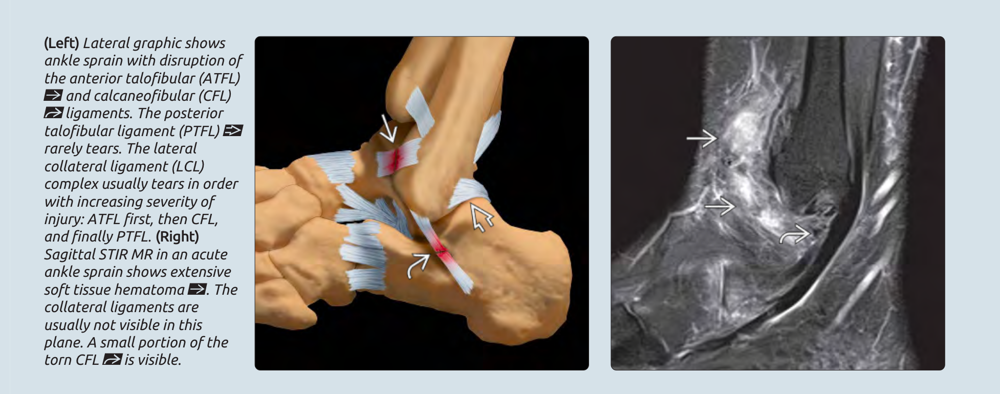

# AnkleNet: ankle-specific model for chronic ankle instability diagnosis

## Background

Chronic ankle instability (CAI), characterized by decreased ankle stability and recurrent injuries, occurs in around 40% of ankle sprain patients. The most severe complication of CAI is end-stage traumatic arthritis, which cannot be completely restored through surgical interventions. Therefore, prompt diagnosis and early intervention are essential. 



## AnkleNet

To facilitate the diagnosis of CAI, we developed a transformer-based model, named AnkleNet. It can detect the injuries of lateral and medial collateral ligaments simultaneously based on MRI, aiding classifying of CAI patients in a detailed way: Normal, LCAI, MCAI, and RCAI.

To train the model, follow the steps below.
 
### Step 1

Preprocess your MRI and make a csv files of your (images label) pairs.

The demo csv files can be found in `data/`.

- `AxialPath`: the image path of axial mri

- `CoronalPath`: the image path of coronal mri

- `label1`: lateral collateral ligament injury

- `label2`: medial collateral ligament injury

### Step 2

Modify your training configs. 

The config templete can be cound in `config/`.

### Step 3

Train the model. Run:

```sh
python main_train.py --opt config/anklenet.yaml
```

---

**Acknowlegements**

- vit-pytorch (https://github.com/lucidrains/vit-pytorch)

- pytorch-grad-cam (https://github.com/jacobgil/pytorch-grad-cam)

